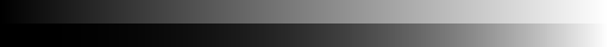
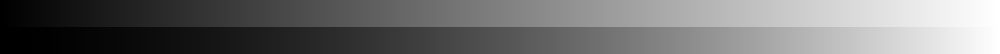
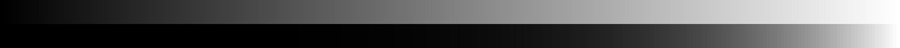

# ЛР1 - простые операции, гамма-коррекция

## Описание
Консольное приложение, генерирующее одноканальное 8bpp изображение с градиентной заливкой и гамма-корректированной заливкой, расположенными горизонтально. Каждому цвету соответствует прямоугольник с заранее заданными параметрами высоты и ширины с умолчательными значениями *30* и *3* пикселей соответсвенно.

## Входные параметры приложения
- ***h*** или ***height*** - высота каждого прямоугольника;
- ***s*** или ***width*** - ширина каждого прямоугольника;
- ***g*** или ***gamma*** - коэф. гамма-коррекции;
- *имя файла* - опциональный бесключевой параметр. В случае его отсутствия изображение будет выведено на экран в отдельном окне;

## Пример работы при умолчательных параметрах
- **h = 30**
- **s = 3**
- **g = 2.4**

## Примеры работы при иных параметрах
- **h = 70**
- **s = 10**
- **g = 1.6**

- **h = 70**
- **s = 10**
- **g = 5.0**

