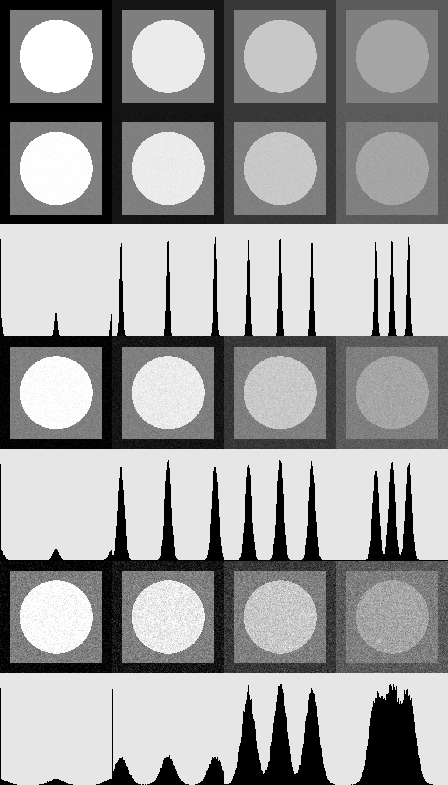

# ЛР2 - гистограммы и аддитивный шум

## Описание
Консольное приложение, генерирующее одноканальное 8bpp изображение состоящее из 4 образцов вида: внешний квадрат со стороной *256 (равно стороне изображения)*, внутренний квадрат со стороной *209* и круг радиусом *83* пикселей.
Фигуры образцов имеют следующие исходные цвета:
- *[0, 127, 255]*
- *[20, 127, 235]*
- *[55, 127, 200]*
- *[90, 127, 165]*

На каждый образец накладывается нормальный аддитивный шум с 3 уровнями среднеквадратичного отклонения: *3*, *7* и *15*.

Для каждого образца и каждого уровня шума строится гистограмма *256х256* с максимальной высотой столбца *230* пикселей. Кроме того, для каждого образца вычисляются среднее значение цвета и среднеквадратичное отклонение.

Итоговое изображение выводится на экран в отдельном окне.
s
## Результат работы

Результаты исследования образцов:
**Первая линия - среднеквадратичное отклонение = *3*:**
|s1-mean|s1-stddev|s2-mean|s2-stddev|s3-mean|s3-stddev|s4-mean|s4-stddev|
|-|-|-|-|-|-|-|-|
1.19|1.78|19.98|3.01|54.99|2.99|90.01|3.04|
126.99|2.98|127.02|3.01|127.01|3.01|127.02|3.01|
253.81|1.75|234.99|2.99|199.99|3.04|164.98|2.98|

**Вторая линия - среднеквадратичное отклонение = *7*:**
|s1-mean|s1-stddev|s2-mean|s2-stddev|s3-mean|s3-stddev|s4-mean|s4-stddev|
|-|-|-|-|-|-|-|-|
2.80|4.08|19.96|7.05|54.95|6.99|90.03|7.00|
126.99|7.02|127.00|6.97|127.05|7.02|126.92|6.99|
252.18|4.11|234.97|7.10|199.94|7.08|165.01|6.98|

**Вторая линия - среднеквадратичное отклонение = *15*:**
|s1-mean|s1-stddev|s2-mean|s2-stddev|s3-mean|s3-stddev|s4-mean|s4-stddev|
|-|-|-|-|-|-|-|-|
5.99|8.75|20.66|13.90|55.03|15.07|90.08|14.94|
127.04|15.06|127.08|15.06|127.04|14.97|126.91|15.06|
249.07|8.68|234.53|13.79|200.11|15.02|165.03|15.05|