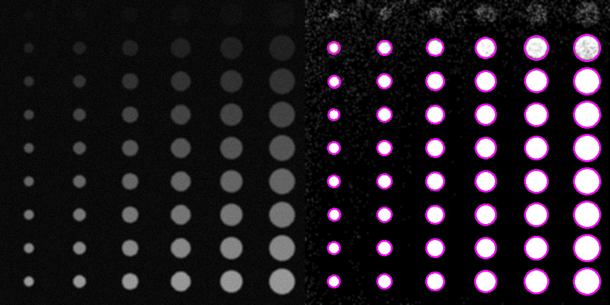

# ЛР4 - бинаризация и простое детектирование объектов

## Описание
Приложение, предназначенное для бинаризации и детектирования объектов на входном изображении.

Приложение включает в себя генератор сэмплов в виде выходных изображений и соответствующих им json-файлов с данными о положении и размере объектов на картинке для последующего контроля качества.

Приложение подразумевает пользовательский интерфейс с ползунками для управления параметрами бинаризации и детекции.

## Исходные данные
Исходные данные представлены в директории *test_data*, для каждого изображения представлен сгенерированный сэмпл: 
    

А так же соответствующий сэмплу json-файл с настоящим расположением и размером объектов на изображении. По этому файлу затем строятся маски для каждого объекта на отедльных изображениях:
    

## Бинаризация
В приложении используется адаптивная бинаризация.

Для настройки бинаризации ползунками доступны следующие опции:
- *режим работы*
- *инверсия*
- *размер блока*
- *константа*

После применения адаптивной бинаризации получается следующее изображение (на примере сэмпла №1):
    

## Детекция
Из бинаризованного изображения путем использования детектирования при помощи компонент связности получается набор сдетектированных объектов.

Для настройки детекции ползунками доступны следующие опции:
- *минимальный размер объекта*
- *максимальный размер объекта*
- *размер ядра размытия*

Перед применением поиска компонент связности, на изображение накладывается размытие Гаусса с настраиваемым размером ядра.
Полученный набор объектов фильтруется по заданным минимальному и максимальному размерам детекции, заданным в параметрах ползунками.

Для оценки качества аналогично исходным данным, каждый детектированный объект на изображении маскируется: 
    

После применения размытия перед детекцией получается следующее изображение (на примере сэмпла №1):
    

Для оценки качества для каждого объекта по построенной для него маске считаются параметры IOU для объектов из json со входными данными.

## Настройки для оценки качества
Для тестирования применялись следующие настройки бинаризации:
- ***Размер блока = 167***
- ***Константа = 7.1***

Для тестирования применялись следующие настройки детекции:
- ***Мин. размер = 5 пикселей***
- ***Макс. размер = 40***
- ***Размер ядра размытия = 7***

## Примеры работы приложения
На каждый сэмпл накладываются аддитивный шум и размытие Гаусса с различными параметрами

**Пример 1:**
- Отклонение шума = 5
- Размытие - отсутствует
    
    <!-- - TP = 66
    - FP = 0
    - FN = 0 -->
 

**Пример 2:**
- Отклонение шума = 5
- Размер ядра размытия = 3
- Отклонение размытия = 5
    
    <!-- - TP = 36
    - FP = 0
    - FN = 0 -->
 

**Пример 3:**
- Отклонение шума = 3
- Размер ядра размытия = 3
- Отклонение размытия = 5
    
    <!-- - TP = 30
    - FP = 0
    - FN = 5 -->
 

**Пример 4:**
- Отклонение шума = 5
- Размер ядра размытия = 5
- Отклонение размытия = 7
    
    <!-- - TP = 48
    - FP = 0
    - FN = 6 -->
 

**Пример 5:**
- Отклонение шума = 5
- Размер ядра размытия = 5
- Отклонение размытия = 7
    
    <!-- - TP = 135
    - FP = 7
    - FN = 9 -->
 

**Пример 6:**
- Отклонение шума = 5
- Размер ядра размытия = 5
- Отклонение размытия = 7
    
    <!-- - TP = 57
    - FP = 7
    - FN = 6 -->

Итоговая сводная таблица замеров по всем изображениям:
|         |sample1|sample2|sample3|sample4|sample5|sample6|total|
|---------|-------|-------|-------|-------|-------|-------|-----|
|TP       |   66  |   36  |   30  |   48  |   135 |   57  | 372 |
|FP       |   0   |    0  |   0   |   0   |   7   |   7   | 14  |
|FN       |   0   |    0  |   5   |   6   |   9   |   6   | 26  |
|Precision|   1   |   1   |   1   |   1   |  0.95 |  0.9  | 0.96|
|Recall   |   1   |   1   | 0.86  |  0.89 |  0.94 |  0.9  | 0.93|
