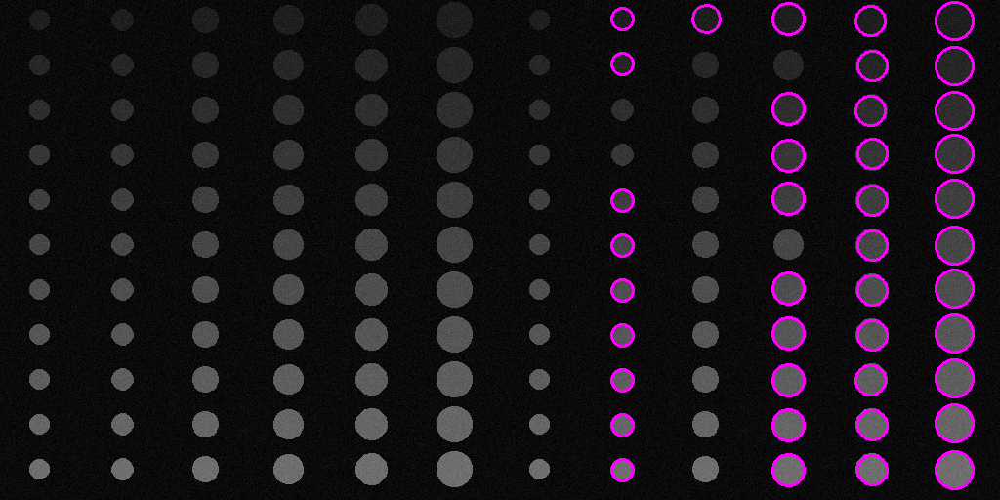

# ЛР6 - детекция Хафа

## Описание
Приложение, предназначенное для детектирования объектов на входном изображении.

Приложение включает в себя генератор сэмплов в виде выходных изображений и соответствующих им json-файлов с данными о положении и размере объектов на картинке для последующего контроля качества.

## Детекция и настройки
Из бинаризованного изображения путем использования детектирования методом Хафа.

Для тестирования применялись следующие настройки детекции:
- ***Мин. размер = 3 пикселей***
- ***Макс. размер = 20***
- ***Параметр 1 = 35***
- ***Параметр 2 = 50***

## Примеры работы приложения
На каждый сэмпл накладываются аддитивный шум и размытие Гаусса с различными параметрами

- Отклонение шума = 5
- Размытие - отсутствует
    
