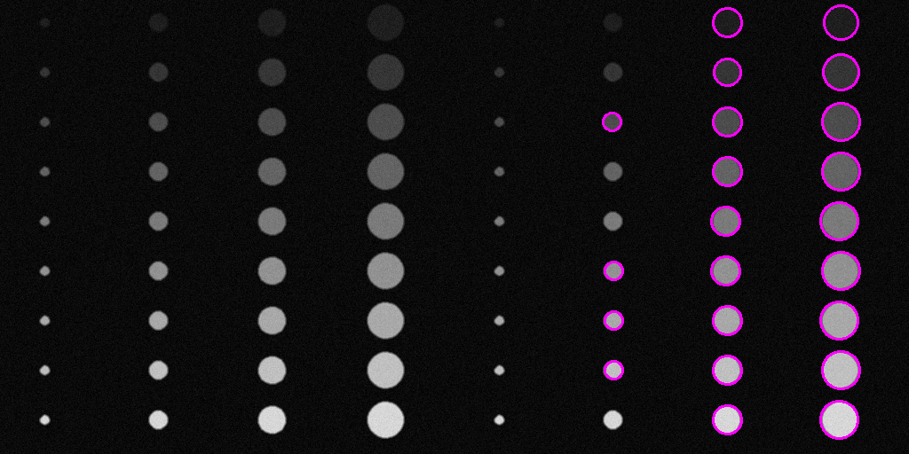
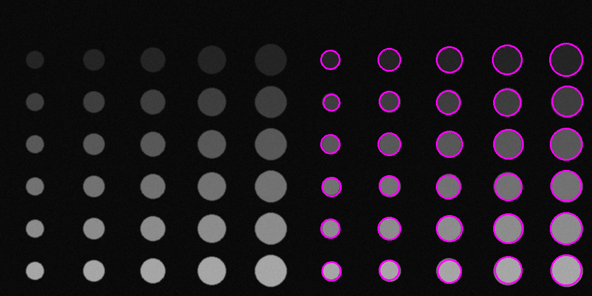
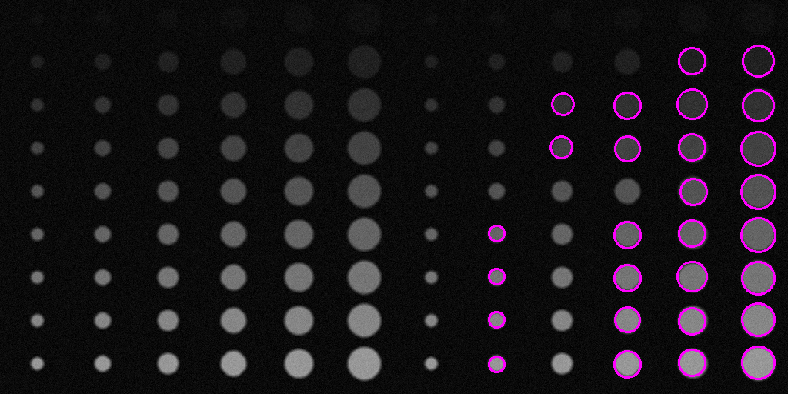
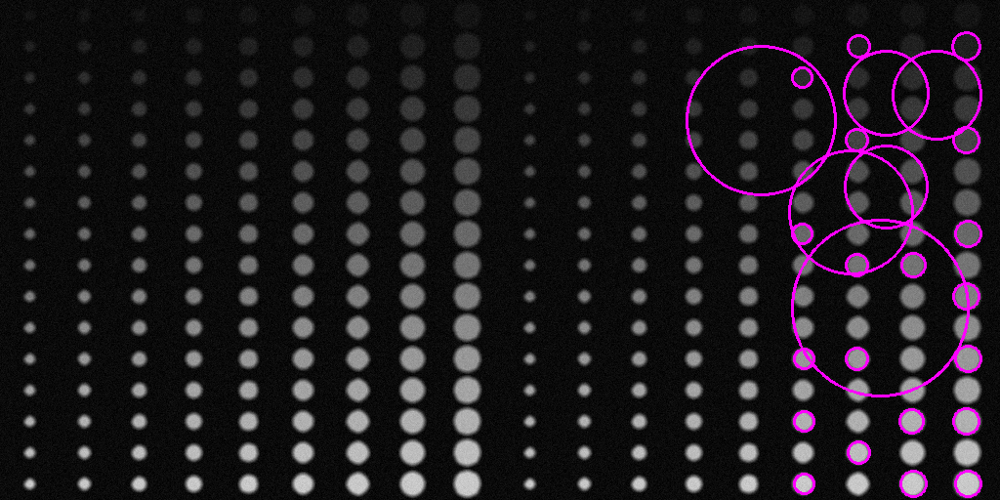
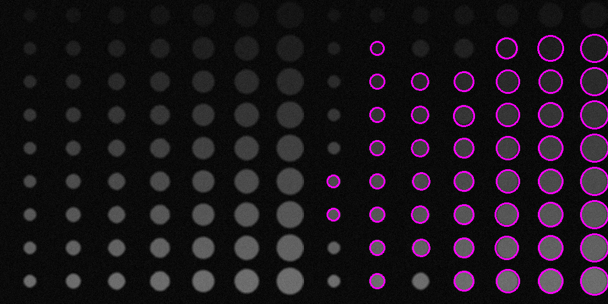

# ЛР6 - детекция Хафа

## Описание
Приложение, предназначенное для детектирования объектов на входном изображении.

Приложение включает в себя генератор сэмплов в виде выходных изображений и соответствующих им json-файлов с данными о положении и размере объектов на картинке для последующего контроля качества.

## Детекция и настройки
Из бинаризованного изображения путем использования детектирования методом Хафа.

Для тестирования применялись следующие настройки детекции:
- ***Мин. размер = 3 пикселей***
- ***Макс. размер = 20***
- ***Параметр 1 = 35***
- ***Параметр 2 = 50***

## Примеры работы приложения и оценка качества
На каждый сэмпл накладываются аддитивный шум и размытие Гаусса с различными параметрами.
Для каждой детекции производится подсчет TP, FP, FN с трешхолдами от 0.2 до 0.9 с шагом 0.1, по результатам чего строится кривая FROC и подсчитывается площадь под ней. 

- Отклонение шума = 5
- Размытие - отсутствует
    
- Значение FROC: 0.24
 
- Отклонение шума = 5
- Размер ядра размытия = 3
- Отклонение размытия = 5
    
- Значение FROC: 0.16
 
- Отклонение шума = 3
- Размер ядра размытия = 3
- Отклонение размытия = 5
    
- Значение FROC: 0.33
 
- Отклонение шума = 5
- Размер ядра размытия = 5
- Отклонение размытия = 7
    
- Значение FROC: 0.14
 
- Отклонение шума = 5
- Размер ядра размытия = 5
- Отклонение размытия = 7
    
- Значение FROC: 0.053
 
- Отклонение шума = 5
- Размер ядра размытия = 5
- Отклонение размытия = 7
    
- Значение FROC: 0.085