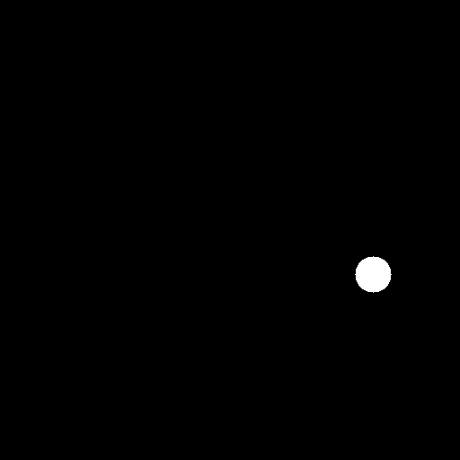

# ЛР6 - детекция Хафа

## Описание
Приложение, предназначенное для детектирования объектов на входном изображении.

Приложение включает в себя генератор сэмплов в виде выходных изображений и соответствующих им json-файлов с данными о положении и размере объектов на картинке для последующего контроля качества.

## Детекция и настройки
Из бинаризованного изображения путем использования детектирования методом Хафа. На вход подается исходное изображение. Детектор возвращает координаты центра и радиус для каждого сдетектированного объекта. На основании этих данных строятся маски для каждого сдетектированного объекта, которые затем используются для оценки качества.
    

Для тестирования применялись следующие настройки детекции:
- ***Мин. размер = 3 пикселей***
- ***Макс. размер = 20***
- ***Параметр 1 = 35***
- ***Параметр 2 = 50***

## Примеры работы приложения и оценка качества
На каждый сэмпл накладываются аддитивный шум и размытие Гаусса с различными параметрами.
По json-файлу для исходного изображения строятся маски для каждого объекта, после чего считаются значения IOU, на основании которых для каждой детекции производится подсчет и TP, FP с фиксированным трешхолдом **0.84**, отсеивая детекции по трешхолдам, полученным как среднее "соседних" по значениям оценок детекций, по результатам чего строится кривая FROC.

- Отклонение шума = 5
- Размытие - отсутствует
    
    
- Площадь под кривой = 4

 

- Отклонение шума = 5
- Размер ядра размытия = 3
- Отклонение размытия = 5
    
    
- Площадь под кривой = 3.63

 

- Отклонение шума = 3
- Размер ядра размытия = 3
- Отклонение размытия = 5
    
    
- Площадь под кривой = 3.46

 

- Отклонение шума = 5
- Размер ядра размытия = 5
- Отклонение размытия = 7
    
    
- Площадь под кривой = 2.54

 

- Отклонение шума = 5
- Размер ядра размытия = 5
- Отклонение размытия = 7
    
    
- Площадь под кривой = 1.57

 

- Отклонение шума = 5
- Размер ядра размытия = 5
- Отклонение размытия = 7
    
    
- Площадь под кривой = 2.2