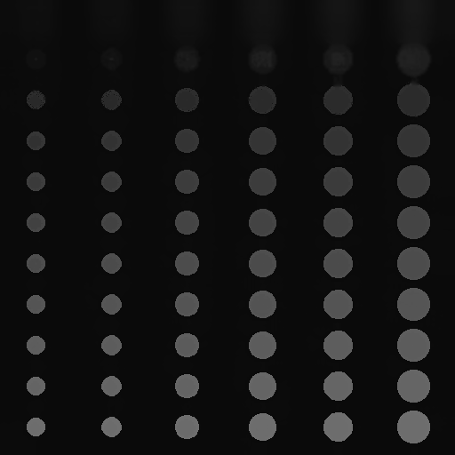
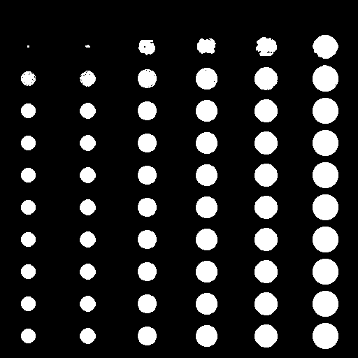
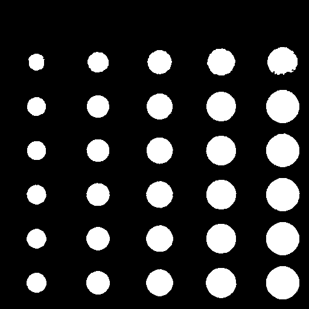
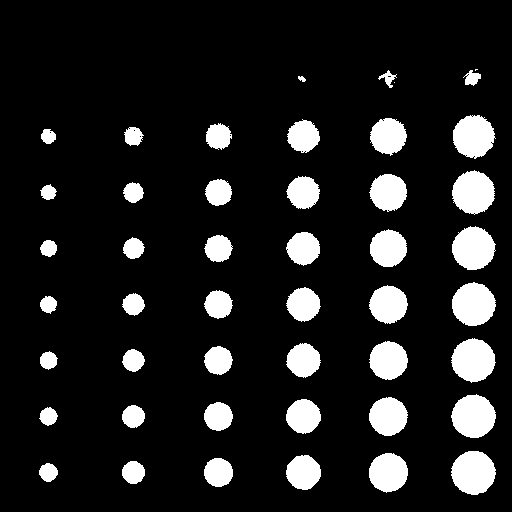
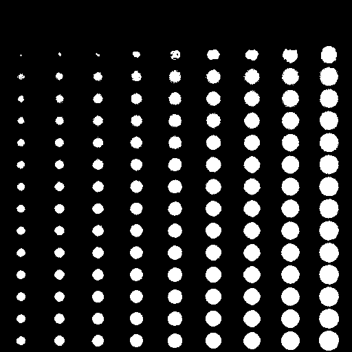
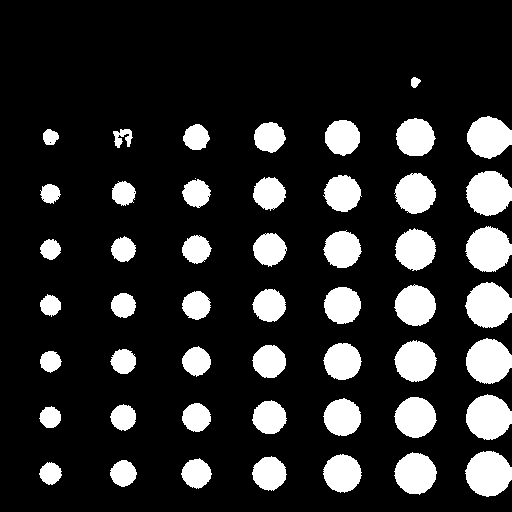

# ЛР7 - сегментация

## Описание
Приложение, предназначенное для сегментации объектов на входном изображении.

## Детекция и настройки
Входное изображение сегментируется методом MeanShift:

После чего используется адаптивная бинаризация:

Для тестирования применялись следующие настройки бинаризации:
- ***Размер блока = 167***
- ***Константа = 7.1***

## Примеры работы приложения и оценка качества
На каждый сэмпл накладываются аддитивный шум и размытие Гаусса с различными параметрами.
Для каждого изображения *попиксельно* считаются статистики TP, FP, FN

- Отклонение шума = 5
- Размытие - отсутствует
    
    - TP = 9581
    - FP = 10477
    - FN = 34683
 
- Отклонение шума = 3
- Размер ядра размытия = 3
- Отклонение размытия = 5
    
    - TP = 15829
    - FP = 13224
    - FN = 36888
 
- Отклонение шума = 5
- Размер ядра размытия = 5
- Отклонение размытия = 7
    
    - TP = 6327
    - FP = 5805
    - FN = 34389
 
- Отклонение шума = 5
- Размер ядра размытия = 5
- Отклонение размытия = 7
    
    - TP = 8566
    - FP = 8156
    - FN = 34314
 
- Отклонение шума = 5
- Размер ядра размытия = 5
- Отклонение размытия = 7
    
    - TP = 5192
    - FP = 10972
    - FN = 51589