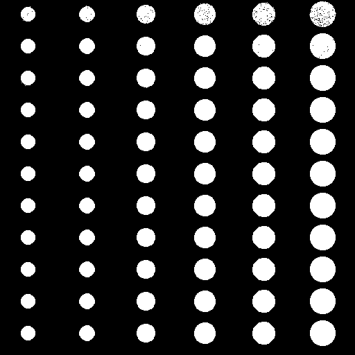
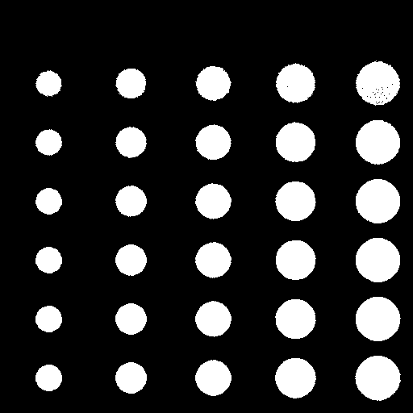
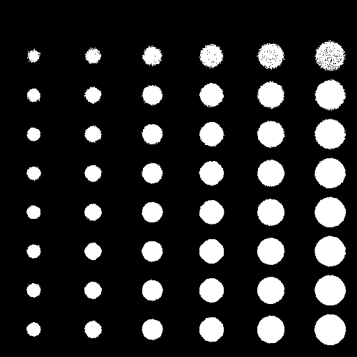
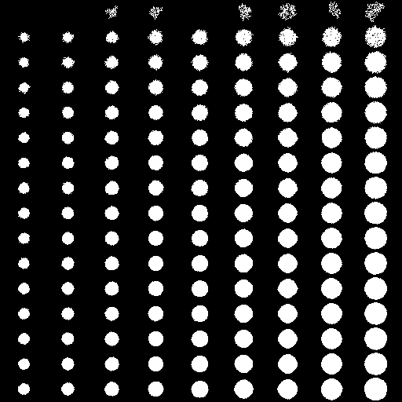
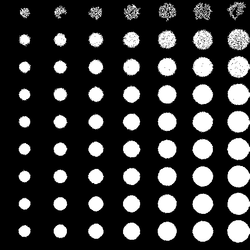

# ЛР7 - сегментация

## Описание
Приложение, предназначенное для сегментации объектов на входном изображении.

## Детекция и настройки
Входное изображение сегментируется методом MeanShift:

После чего используется адаптивная бинаризация:

Для тестирования применялись следующие настройки бинаризации:
- ***Размер блока = 167***
- ***Константа = 7.1***

## Примеры работы приложения и оценка качества
На каждый сэмпл накладываются аддитивный шум и размытие Гаусса с различными параметрами.
Для каждого изображения *попиксельно* считаются статистики TP, FP, FN.

- Отклонение шума = 5
- Размытие - отсутствует
    
    <!-- - TP = 9581
    - FP = 10477
    - FN = 34683 -->
 

- Отклонение шума = 3
- Размер ядра размытия = 3
- Отклонение размытия = 5
    
    <!-- - TP = 15829
    - FP = 13224
    - FN = 36888 -->
 

- Отклонение шума = 5
- Размер ядра размытия = 5
- Отклонение размытия = 7
    
    <!-- - TP = 6327
    - FP = 5805
    - FN = 34389 -->
 

- Отклонение шума = 5
- Размер ядра размытия = 5
- Отклонение размытия = 7
    
    <!-- - TP = 8566
    - FP = 8156
    - FN = 34314 -->
 

- Отклонение шума = 5
- Размер ядра размытия = 5
- Отклонение размытия = 7
    
    <!-- - TP = 5192
    - FP = 10972
    - FN = 51589 -->

Итоговая сводная таблица замеров по всем изображениям:
|         |sample1|sample2|sample3|sample4|sample5|total  |
|---------|-------|-------|-------|-------|-------|-------|
|TP       | 9581  | 15829 | 6327  |  8566 | 5192  | 45495 |
|FP       | 10477 | 13224 | 5805  |  8156 | 10972 | 48634 |
|FN       | 34683 | 36888 | 34389 | 34314 | 51589 |191863 |
|Precision| 0.47  | 0.54  | 0.52  |  0.51 |  0.32 | 0.48  |
|Recall   | 0.22  |  0.3  | 0.16  |  0.2  |  0.1  | 0.19  |

Для каждого тестового изображения производилось сравнение с результатом детекции из ЛР №4. Для каждого изображения из ЛР №4 были аналогично пересчитаны характеристики TP, FP, FN попиксельно.
Для тестирования используются параметры, аналогичные ЛР №4:
> Бинаризация:
    > - ***Размер блока = 167***
    > - ***Константа = 7.1***

> Детекция:
    > - ***Мин. размер = 5 пикселей***
    > - ***Макс. размер = 40***
    > - ***Размер ядра размытия = 7***

Сводная таблица со сравнением результатов детекции из ЛР №4 и сегментации:
|       |04 TP|04 FP|04 FN|04 Precision|04 Recall|04 Result|07 TP|07 FP|07 FN|07 Precision|07 Recall|07 Result|
|-------|-----|-----|-----|------|------|------|-----|-----|-----|------|------|------|
|sample1|44021|13|243|0.99|0.99||9581|10477|34683|0.47|0.22||
|sample2|44936|1435|7781|0.97|0.85||15829|13224|36888|0.54|0.3||
|sample3|35561|3637|5155|0.91|0.87||6327|5805|34389|0.52|0.16||
|sample4|40477|7915|2403|0.83|0.94||8566|8156|34314|0.51|0.2||
|sample5|51105|2970|5676|0.95|0.9 ||5192|10972|51589|0.32|0.1||