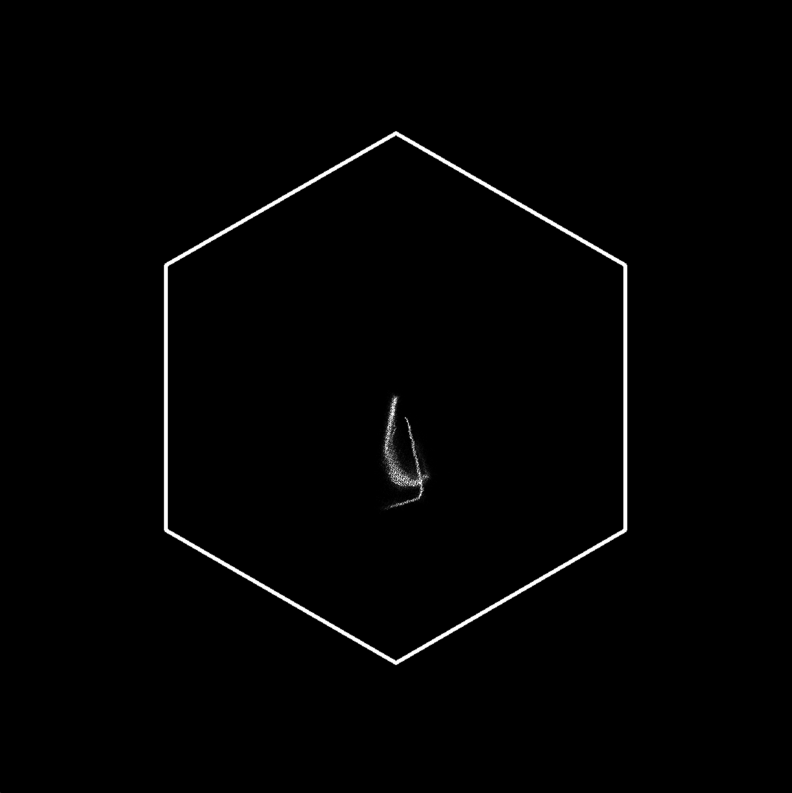
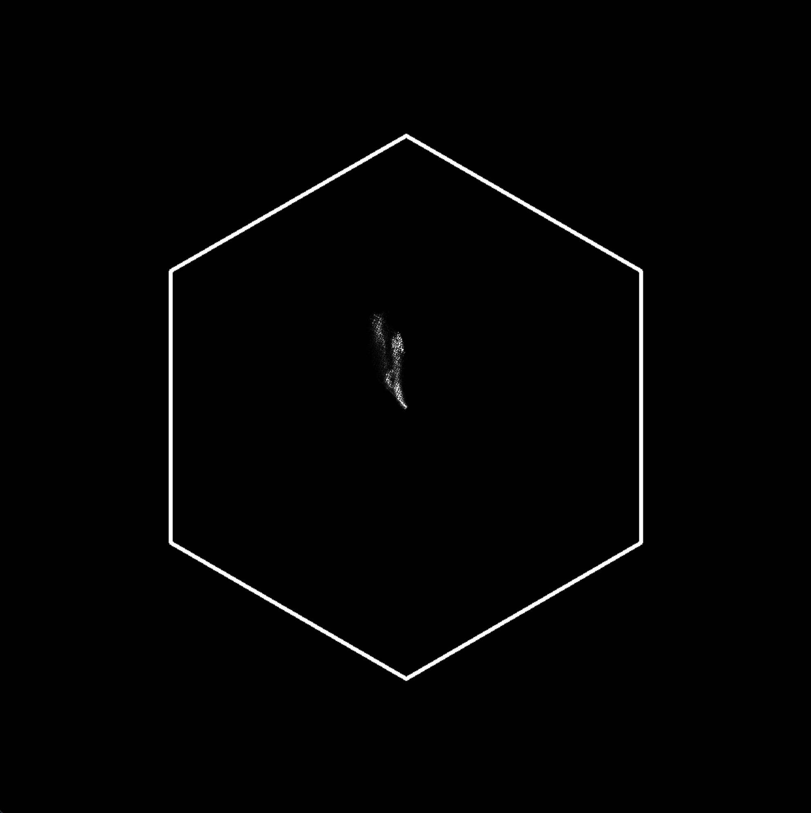

# ЛР8 - плотность цвета

## Описание
Приложение, предназначенное для балансировки белого на входных изображениях.

## Примеры работы приложения
Для следующего изображения, на котором очевидно преобладают синие цвета:

На выходе получается следующая диаграмма распределения:

Для следующего изображения, на котором очевидно преобладают желтые оттенки:

На выходе получается следующая диаграмма распределения:
