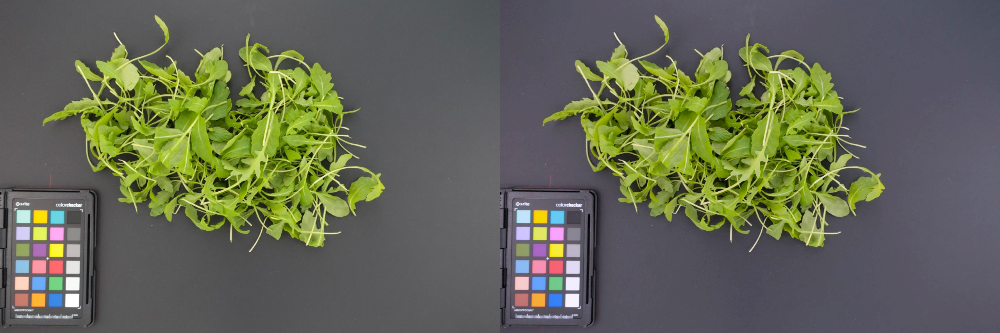

# ЛР9 - баланс белого, модель серго мира

## Описание
Приложение, предназначенное для балансировки белого на входных изображениях.

Приложение конвертирует изначальное изображение из *sRGB* в *linRGB*, после чего применяет балансировку белого алгоритмом серого мира (цвет каждого пикслея умножается на отношение среднего средних по каналам к среднему изменяемого канала). После балансировки производится обратная конвертация из *linRGB* в *sRGB*.

На изображении предварительно маскируется таблица; по изображению с маской считаются средние по каналам.

Полученный коэффициент *(среднее средних по каналам / среднее по каналу)* затем применяется к исходной картинке без маскировки.

## Примеры работы приложения

## Оценка качества
Оценка произвоилась на следующем изображении, на котором присутствует калибровочная таблица:

Для оценки применялся метод RMSE - среднеквадратичное отклонение от значения цвета, заявленного производителем таблицы. Отклонение считалось для градаций серого свреху вниз по таблице:
|Цвет|Отклонение|
|-|-|
|{243, 243, 242}|12.27|
|{200, 200, 200}|15.97|
|{160, 160, 160}|15.73|
|{122, 122, 121}|15.81|
|{85, 85, 85}|14.21|
|{52, 52, 52}|15.97|